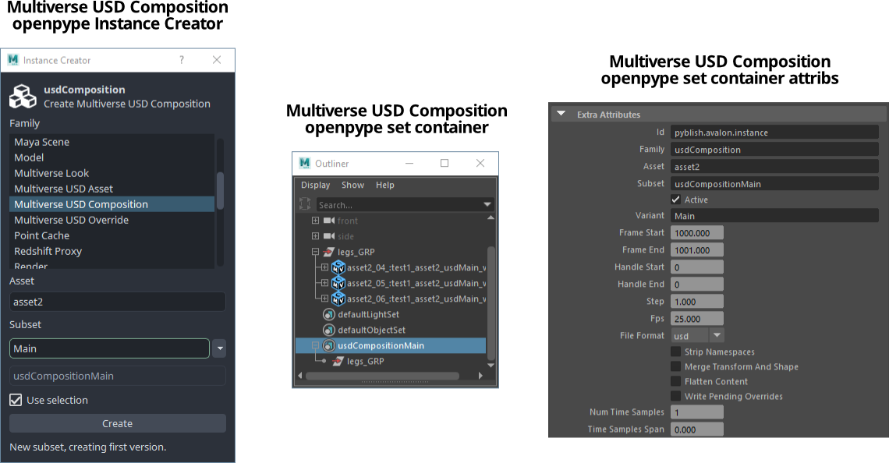
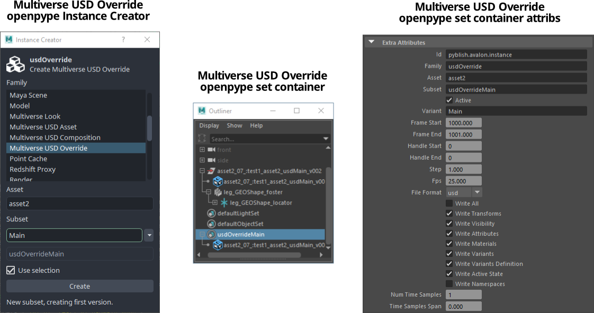
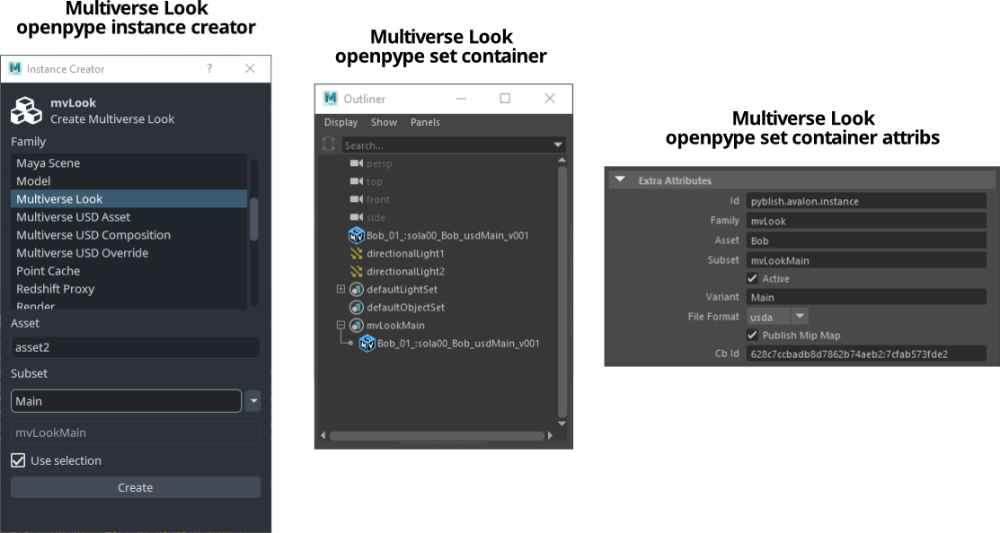
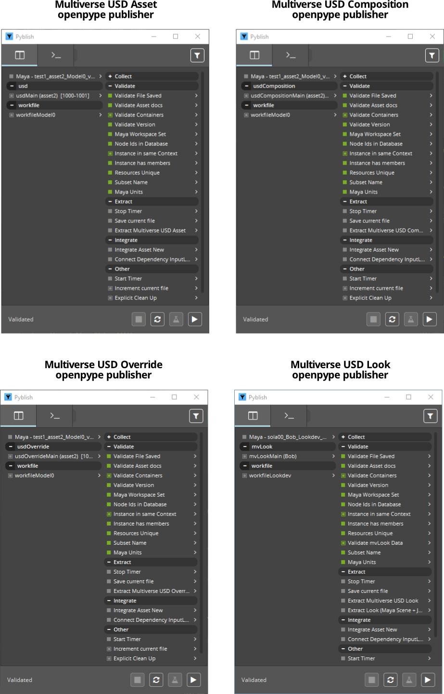

import ReactMarkdown from "react-markdown";
import versions from '@site/docs/assets/json/Ayon_addons_version.json'

<ReactMarkdown>
{versions.Maya_Badge}
</ReactMarkdown>

## Working with Multiverse in AYON

AYON supports creating, publishing and loading of [Multiverse | USD](
https://multi-verse.io) data. The minimum Multiverse version supported is v6.7,
and version 7.0 is recommended.

In a nutshell it is possible to:

- Create USD Assets, USD compositions, USD Overrides.

  This _creates_ AYON instances as Maya set nodes that contain information
  for published USD data.

- Create Multiverse Looks.

  This _creates_ AYON instances as Maya set nodes that contain information
  for published Maya shading networks data and USD material assignment data.

- Publish USD Assets, USD compositions and USD Overrides.

  This _writes_ USD files to disk and _publishes_ information to the AYON
  database.

- Publish Multiverse Looks.

  This _writes_ a Maya file containing shading networks (to import in Maya), a USD override file containing material assignment information (to layer in a Multiverse Compound), it copies original & mip-mapped textures to disk and _publishes_ information to the AYON database.

- Load any USD data into Multiverse "Compound" shape nodes.

  This _reads_ USD files (and also Alembic files) into Maya by _streaming_ them to the viewport.

- Rendering USD data procedurally with 3Delight<sup>NSI</sup>, Arnold, Redshift, RenderMan and VRay.

  This reads USD files by _streaming_ them procedurally to the renderer, at render time.

USD files written by Multiverse are 100% native USD data, they can be exchange with any other DCC applications able to interchange USD. Likewise, Multivers can read native USD data created by other applications. The USD extensions ar supported: `.usd` (binary), `.usda` (ASCII), `.usdz`. (zipped, optionally wit textures). Sequences of USD files can also be read via "USD clips".

It is also possible to load Alembic data (`.abc`) in Multiverse Compounds further compose it & ov rride it in other USD files, and render it procedurally.
Alembic data is always converted on the fly (in memory) to USD data. USD clip from Alembic data are also supported.


### Configuration

To configure Multiverse in AYON, an admin privileges needs to setup a new
AYON tool in the AYON Project Settings, using a similar configuration as
the one depicted here:


```
{
    "MULTIVERSE_PATH": "/Path/to/Multiverse-{MULTIVERSE_VERSION}",
    "MAYA_MODULE_PATH": "{MULTIVERSE}/Maya;{MAYA_MODULE_PATH}"
}

{
    "MULTIVERSE_VERSION": "7.1.0-py27"
}

```

The Multiverse Maya module file (.mod) pointed above contains all the necessary
environment variables to run Multiverse.

The AYON settings will contain blocks to enable/disable the Multiverse
Creators and Loader, along with sensible studio setting.

For more information about setup of Multiverse please refer to the relative page
on the [Multiverse official documentation](https://multi-verse.io/docs).


### Understanding Assets, Compounds, Compositions, Overrides and Layering

In Multiverse we use some terminology that relates to USD I/O: terms like
"Assets", "Compounds", "Compositions", "Overrides" and "Layering".

Please hop to the new [Multiverse Introduction](
https://j-cube.jp/solutions/multiverse/docs/usage/introduction) page on the
official documentation to understand them before reading the next sections.


### Creators

It is possible to create AYON "instances" (resulting in Maya set containers)
for publishing Multiverse USD Assets, Compositions, Overrides and Looks.

When creating AYON instances for Multiverse USD Asset, Composition,
Override and Look, the creator plug-in will put the relative selected data in a
Maya set node which holds the properties used by the Multiverse data writer for
publishing.

You can choose the USD file format in the Creators' set nodes:

- Assets: `.usd` (default) or `.usda` or `.usdz`
- Compositions: `.usda` (default) or `.usd`
- Overrides: `.usda` (default) or `.usd`
- Looks: `.ma` (default)








### Publishers

The relative publishers for Multiverse USD Asset, Composition, Override and Look
are available. The first three write USD files to disk, while look writes a Maya
file along with the mip-mapped textures. All communicate publish info to the
AYON database.




### Loader

The loader creates a Multiverse "Compound" shape node reading the USD file of
choice. All data is _streamed_ to the viewport and not contained in Maya. Thanks
to the various viewport draw options the user can strategically decide how to
minimize the cost of viewport draw effectively being able to load any data, this
allows to bring into Maya scenes of virtually unlimited complexity.


:::tip Note
When using the Loader, Multiverse, by design, never "imports" USD data into the
Maya scene as Maya data. Instead, when desired, Multiverse permits to import
specific USD primitives, or entire hierarchies, into the Maya scene as Maya data
selectively from MEOW, it also tracks what is being imported with a "live
connection" , so upon modification, it is possible to write (create & publish)
the modifies data as a USD file for being layered on top of its relative
Compound. See the [Multiverse Importer](
https://j-cube.jp/solutions/multiverse/docs/usage/importer)) documentation.
:::

### Look

In AYON a Multiverse Look is the combination of:

- a Maya file that contains the shading networks that were assigned to the items
  of a Multiverse Compound.
- a Multiverse USD Override file that contains the material assignment
  information (which Maya material was assigned to which USD item)
- mip-mapped textures

Multiverse Look shading networks are typically Maya-referenced in the lighting
and shot scenes.

Materials are assigned to the USD items in the Compound via the "material
assignment" information that is output in the lookdev stage by a Multiverse
Override. Once published the override can be Layered on the Compound so that 
materials will be assigned to items. Finally, an attribute Override on the root
item of the Compound is used to define the `namespace` with which the shading
networks were referenced in Maya. At this point the renderer knows which
material to assign to which item and it is possible to render and edit the
materials as usual. Because the material exists in Maya you can perform IPR and
tune the materials as you please.

The Multiverse Look will also publish textures in optimized mip-map format,
currently supporting the `.tdl` (Texture Delight) mip map format of the 3Delight
NSI renderer. MipMaps are required when the relative option is checked and you
are publishing Multiverse Looks with the `final` or `-` product, while they are
not required with the `WIP` or `test` products. MipMaps are found automatically
as long as they exist alongside the original textures. Their generation can be
automatic when using 3Delight for Maya or can be manual by using the `tdlmake`
binary utility.


### About embedding shading networks in USD

Alternatively, but also complementary to the Multiverse Look, as of Multiverse
7 it is also possible to write shading networks _inside_ USD files: that is
achieved by using either the Asset writer (if material are defined in the
modeling stage) and the Override writer (if materials are defined in the lookdev
or later stage).

Some interesting consequences of USD shading networks in Multiverse:

1. they can be overridden by a shading network in Maya by assigning in MEOW a
   Maya material as an override
2. they are available for assignment in MEOW, so you can assign a USD material
   to an item as an override
3. From Hypershade you can use the Multiverse USD shading network write File>
   Export option to write USD shading network libraries to then layer on an asset
   and perform 2. again.

Note that:

- Shading networks in USD can then be currently rendered with
  3Delight<sup>NSI</sup>
- Shading networks in USD can be used for interchange with DCC apps. Multiverse
  shading networks are written natively with the USD Shade schema.
- usdPreviewSurface shading networks are too considered embedded shading
  networks, though they are classified separately from non-preview / final
  quality shading networks
- USDZ files use usdPreviewSurface shading networks, and therefore can be, too,
  rendered (with 3Delight<sup>NSI</sup>)
- in case both usdPreviewSurface and final quality shading networks, the latter
  will be used for rendering (while the former can be previewed in the viewport)  
- it is possible to disable rendering of any embedded shading network via the
  relative option in the Compound Attribute Editor.


### Rendering

Multiverse offers procedural rendering with all the major production renderers:

- 3Delight<sup>NSI</sup>
- Arnold
- Redshift
- RenderMan
- VRay

Procedural rendering effectively means that data is _streamed_ to the renderer
at render-time, without the need to store the data in the Maya scene (this
effectively means small .ma/.mb files that load fast) nor in the renderer native
file format scene description file (this effectively means tiny `.nsi` / `.ass`
/ `.vrscene` / `.rib` files that load fast).

This is completely transparent to the user: Multiverse Compound nodes present in
the scene, once a render is launched, will stream data to the renderer in a
procedural fashion.


### Example Multiverse Pipeline and API

An example diagram of the data flow in a Maya pipeline using Multiverse is
available, see the [Multiverse Pipeline](
https://j-cube.jp/solutions/multiverse/docs/pipeline) documentation.


A very easy to use Python API to automate any task is available, the API is
user friendly and does not require any knowledge of the vast and complex USD
APIs. See the [Multiverse Python API](
https://j-cube.jp/solutions/multiverse/docs/dev/python-api.html) documentation.
