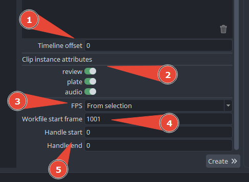

import ReactMarkdown from "react-markdown";
import versions from '@site/docs/assets/json/Ayon_addons_version.json'

<ReactMarkdown>
{versions.TrayPublisher_Badge}
</ReactMarkdown>

import Tabs from '@theme/Tabs';
import TabItem from '@theme/TabItem';

## Editorial Simple Workflow

### Overview

### How to use it?

#### Open Tray Publisher

Select a project and **Confirm**

#### Select context

1. Select a folder. This is usually called "Editorial" and is creating at root level of a project. It is used for storing editorial files.
2. Select a task. Editorial files will be published to this task as editorial product type.
3. Select **Editorial Simple**

#### Drop files

1. Drop EDL/XML files into Drag & Drop area
2. Drop a single media reference file (reflecting the EDL/XML file content) into Drag & Drop area

#### Configure instance requirements

1.  Configure Time offset. This applies only in case the starting timecode off editorial files differs from timecode of the media reference file.
2. Activate clip instances to be created and published
3. Set the **FPS** used in editorial files. The **From selection** option refers to the frame range found in the selected folder in the context selector. If no FPS is set in a folder's attributes, it inherits from the higher levels up to the project root attributes.
4. **Workfile start frame** will be calculated as first frame of shot folder and therefore inherited by any tasks' workfiles in production.
5.  **Handle start/end** adds extra frames to the beginning and end of clip instances. This helps VFX artists who need more frames. The start handle reduces the starting frame number, and the end handle increases the ending frame number based on the clip's length.

#### Create instances

1. Click on **Create** button and wait for while editorial files are processed created instances ready for publishing.
2. Then move mouse to right edge and notice the right arrow will appear. Click on it to get to Publish tab of publisher or just simply click on Publish tab.

#### Publish

:::important Instance context
Notice that an instance context is set to the original selected folder in Create tab. This is currently not possible to change. Reason behind this design is that there are currently limitation in regards of folders which had not been created yet. That is the reason for shot instance attribute **Folder path**

:::

- Instances view can be switched for grouped by product type. This is useful when you want to disable some product types from publishing.

- Multiselection of instances is possible. This is useful when you want to change attributes on multiple instances at once. If attribute is having different value on each instance, it will be shown as **\< Multiselection \>**.

### Resources
- Testing data for Editorial Simple Workflow