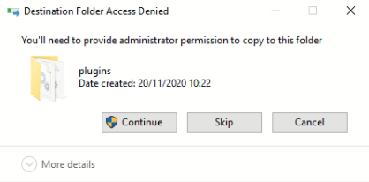
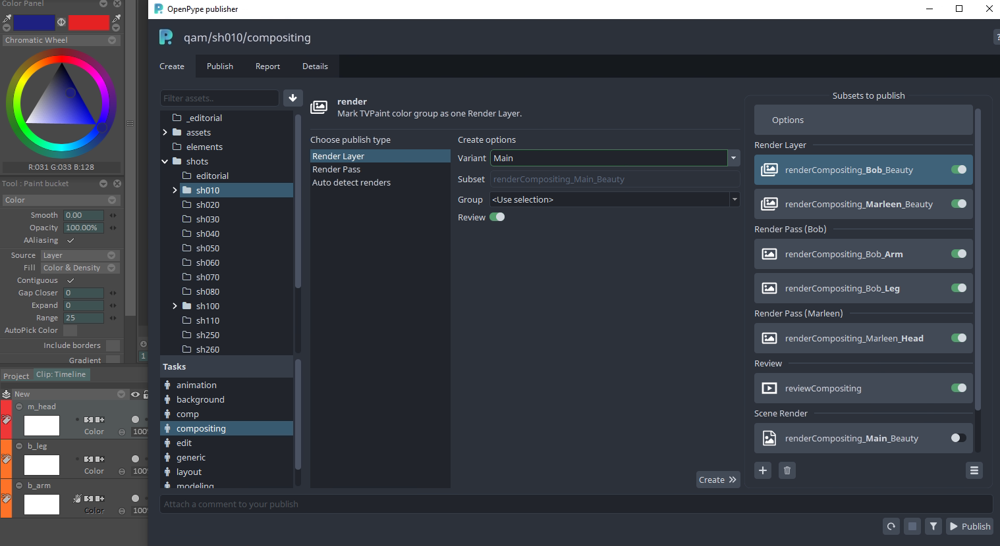
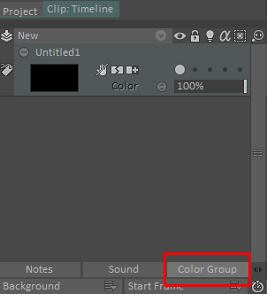
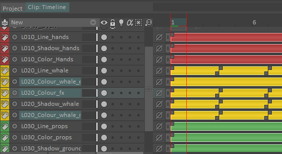

import ReactMarkdown from "react-markdown";
import versions from '@site/docs/assets/json/Ayon_addons_version.json'

<ReactMarkdown>
{versions.TVPaint_Badge}
</ReactMarkdown>

-   [Work Files](artist_tools_workfiles)
-   [Load](artist_tools_loader)
-   [Scene Inventory](artist_tools_inventory)
-   [Publish](artist_tools_publisher)
-   [Library](artist_tools_library_loader)

## Setup
When you launch TVPaint with AYON for the very first time it is necessary to do some additional steps. Right after the TVPaint launching a few system windows will pop up.

Choose `Replace the file in the destination`. Then another window shows up.

Click on `Continue`.

After opening TVPaint go to the menu bar: `Windows → Plugins → AYON`.

Another TVPaint window pop up. Please press `Yes`. This window will be presented in every single TVPaint launching. Unfortunately, there is no other way how to workaround it.

Now AYON Tools menu is in your TVPaint work area.

You can start your work.

---

## Usage
In TVPaint you can find the Tools in AYON menu extension. The AYON Tools menu should be available in your work area. However, sometimes it happens that the Tools menu is hidden. You can display the extension panel by going to `Windows -> Plugins -> AYON`.

## Create & Publish
To be able to publish, you have to mark what should be published. The marking part is called **Create**. In TVPaint you can create and publish **[Reviews](#review)**, **[Workfile](#workfile)**, **[Render Layers](#render-layer)** and **[Render Passes](#render-pass)**.

:::important
TVPaint integration tries to not guess what you want to publish from the scene. Therefore, you should tell what you want to publish.
:::

### Review
`Review` will render all visible layers and create a reviewable output.
- Is automatically created without any manual work.
- You can disable the created instance if you want to skip review.

### Workfile
`Workfile` integrate the source TVPaint file during publishing. Publishing of workfile is useful for backups.
- Is automatically created without any manual work.
- You can disable the created instance if you want to skip review.

### Render Layer

Render Layer bakes all the animation layers of one particular color group together.

- In the **Create** tab, pick `Render Layer`
- Fill `variant`, type in the name that the final published RenderLayer should have according to the naming convention in your studio. *(L10, BG, Hero, etc.)*
  - Color group will be renamed to the **variant** value
- Choose color group from combobox
  - or select a layer of a particular color and set combobox to **&ltUse selection&gt**
- Hit `Create` button

After creating a RenderLayer, choose any amount of animation layers that need to be rendered together and assign them the color group.

You can change `variant` later in **Publish** tab.

 

**How to mark TVPaint layer to a group**

In the bottom left corner of your timeline, you will note a **Color group** button.

It allows you to choose a group by checking one of the colors of the color list.

The timeline's animation layer can be marked by the color you pick from your Color group. Layers in the timeline with the same color are gathered into a group represents one render layer.

### Render Pass

Render Passes are smaller individual elements of a [Render Layer](addon_tvpaint_artist.md#render-layer). A `character` render layer might
consist of multiple render passes such as `Line`, `Color` and `Shadow`.

Render Passes are specific because they have to belong to a particular Render Layer. You have to select to which Render Layer the pass belongs. Try to refresh if you don't see a specific Render Layer in the options.

When you want to create Render Pass
- choose one or several TVPaint layers.
- in the **Create** tab, pick `Render Pass`.
- fill the `variant` with desired name of pass, e.g. `Color`.
- select the Render Layer you want the Render Pass to belong to from the combobox.
  - if you don't see new Render Layer try refresh first.
- Press `Create`

After creating a Render Pass, selected the TVPaint layers that should be marked with color group of Render Layer.

You can change `variant` or Render Layer later in **Publish** tab.

:::warning
You cannot change TVPaint layer name once you mark it as part of Render Pass. You would have to remove created Render Pass and create it again with new TVPaint layer name.
:::

  

In this example, AYON will render selected animation layers within the given color group. E.i. the layers *L020_colour_fx*, *L020_colour_mouth*, and *L020_colour_eye* will be rendered as one pass belonging to the yellow RenderLayer.

Now that you have created the required instances, you can publish them.
- Fill the comment on the bottom of the window.
- Double check enabled instance and their context.
- Press `Publish`.
- Wait to finish.
- Once the `Publisher` turns turns green your renders have been published.

---

## Load
When you want to load existing published work you can reach the `Loader` through the AYON Tools `Load` button.

The supported families for TVPaint are:

- `render`
- `image`
- `background`
- `plate`

To load a family item, right-click on the product you want and import their representations, switch among the versions, delete older versions, copy files, etc.

---

## Scene Inventory
Scene Inventory shows you everything that you have loaded into your scene using AYON. You can reach it through the extension's `Scene Inventory` button.

You can switch to a previous version of the file or update it to the latest or delete items.
