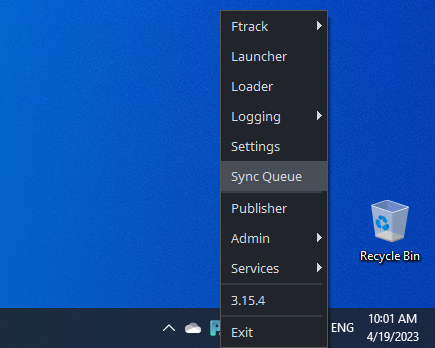

# Loader
Use the **Loader** tool whenever you need to load available published assets into your current workfile scene or script.

## Usage
1. Go to the **AYON** menu and choose the **Loader** tool.
2. In the **Loader** window, go to the left pane with the file browser and select the **Asset** you would like to load into your workfile.
3. In the middle pane, select a desired **product** of the asset you chose beforehand.
4. Right-click on the product to show the **Actions** menu.
5. Select the way the product gets into your scene *(load, reference, ...)*.

import loaderVideo from './assets/core/artist/tools_loader_01.mp4'

<video controls style={{width: "75%" }}>
  <source src={loaderVideo}/>
</video>

---

Here's a screenshot of the Loader window with marked areas for Assets, Products, Info & Data, and the Action menu. You can use various types of filtering of items listed in each area.

## Refresh data
Data is not auto-refreshed to avoid database issues. To refresh assets or products, press the refresh button.

## Load another version

By default, Loader loads the latest existing version, but you can load any other version too. Double-click on the **product** in the **version column** to expose the dropdown and choose the version you want. Then, via the right click actions menu, load it.
 
import loaderVideo2 from './assets/core/artist/tools_loader_02.mp4'
 

<video controls style={{width: "75%" }}>
  <source src={loaderVideo2}/>
</video>

<!--

  

  

-->

## Filtering

### Filter Assets and Products by name
To filter assets/products by name, type the name or part of it in the filter input box. Only assets/products containing the string remain visible

### Filter Products by Family

To filter [products](artist_concepts.md#product) by their [families](artist_publish.md#families) use the families list where you can check families you want to see or uncheck families you are not interested in.

import loaderVideo3 from './assets/core/artist/tools_loader_03.mp4'

<video controls style={{width: "75%" }}>
  <source src={loaderVideo3}/>
</video>

## Product groups

Products may be grouped to improve readability in the **Loader**. You can toggle the visibility of groups with the `Enable Grouping` checkbox.

### Add to group or change current group
You can set the group of selected products with the shortcut `Ctrl + G`. If needed, you can remove the existing group by selecting it first and hitting `Ctrl + G`, leaving its name empty, which removes the group completely.

import loaderVideo4 from './assets/core/artist/tools_loader_04.mp4'

<video controls style={{width: "75%" }}>
  <source src={loaderVideo4}/>
</video>

:::note
Your group setup will take effect for all users working on the project being shared across the database.
:::

___

## Site Sync support

If **Site Sync** is enabled in AYON Studio Settings, an additional widget appears in the Loader's bottom-right corner. This widget allows the user to share work across multiple sites, whether it's a local drive or a remote site like Google Drive. The widget offers a set of tools for transferring data across sites.

It contains a list of all representations for the selected asset and their availability on a particular site:

- *active*: yours
- *remote*: theirs

As seen above, there are representation files available only on the remote site, but not on the local site. If you want to work with the files, you need to download them first. To download a particular representation, right-click on it and select the *Download* action.

:::note
You can use multiselection for representations to mark them for downloading in one step.
:::

If the AYON Tray is running, these files will be transferred in the background for you and show up on the local active site.

For more details of progress, state, or possible error details, open the [Sync Queue](#Sync-Queue) item in the AYON Tray app.

